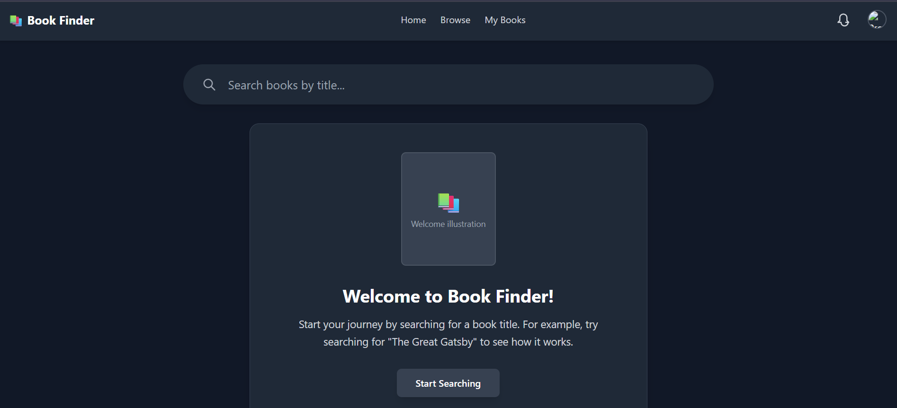
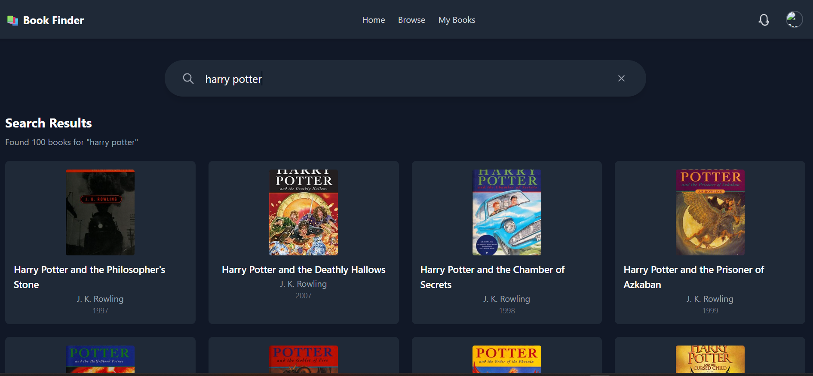

📚 Book Finder

Book Finder is a React-based web app that lets you search books using the Open Library API. It provides a simple interface to look up book titles, view authors, publication year, and cover images.

[🌐Live Demo:](https://book-finder-beta-plum.vercel.app/)

✨ Features

🔎 Search books by title

🕑 Search history dropdown for quick access

📖 Book details including cover, author, and first publish year

🎨 Clean UI with Tailwind CSS

⏳ Loading states and friendly error messages

📱 Responsive design (works on mobile & desktop)


🛠️ Tech Stack

->React
 – Frontend framework

->Tailwind CSS
 – Styling

-> Library API
 – Book data


📂 Project Structure
```
src/
 ├── components/
 │    ├── BookCard.jsx       # Displays a single book
 │    ├── BookList.jsx       # Grid of books
 │    ├── ErrorMessage.jsx   # Error UI with retry option
 │    ├── Header.jsx         # App header with navigation
 │    ├── Loader.jsx         # Spinner loader
 │    └── SearchBar.jsx      # Input with search + history
 │
 ├── pages/
 │    └── Home.jsx           # Main search/results page
 │
 ├── utils/
 │    └── api.js             # fetchBooks function (Open Library API calls)
 │
 ├── App.jsx                 # Root app component
 └── index.js                # Entry point

```

🚀 Getting Started
```
1. Clone the repo
git clone https://github.com/your-username/book-finder.git
cd book-finder

2. Install dependencies
npm install

3. Run the development server
npm run dev


Then open http://localhost:5173/
 in your browser (if using Vite).

4. Build for production
npm run build
npm run preview
```

🔑 API Used

The app fetches book data from the Open Library API. Example search request:

https://openlibrary.org/search.json?q=harry+potter

📸 Screenshots

### Landing Page


### Search Results



📜 License

This project is open source under the MIT License.
